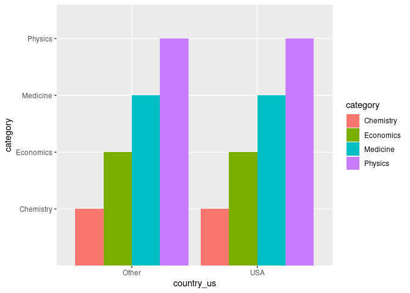
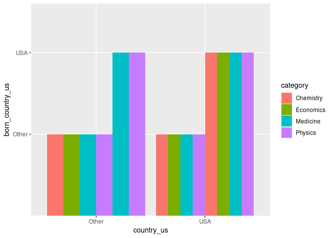

Lab 05 - Nobel laureates
================

Team Name: DS5

Team Members - Name and Student ID

1.  Manar mohsen almutairi  220100526

## Packages

Load tidyverse below

``` r
library(tidyverse)
```

## Data

The dataset for this lab can be found as a CSv (comma separated values)
file in the `data` folder of your repository.

Get the code from the lab document

``` r
nobel <- read_csv("data/nobel.csv")
```

## Get to know your data

1.  How many observations and how many variables are in the dataset? Use
    inline code to answer this question. What does each row represent?  
    observation : 953 variables: 26 represent ont person who had get
    nobel..

``` r
 dim(nobel)
```

    ## [1] 935  26

Each row represents information about a nobel prize winner.

2.  Create a new data frame called `nobel_living` that filters for

-   laureates for whom `country` is available
-   laureates who are people as opposed to organizations (organizations
    are denoted with `"org"` as their `gender`)
-   laureates who are still alive (their `died_date` is `NA`)

Get the code from the lab document

``` r
 nobel_living <-nobel %>% filter(is.na(died_date) ,country!="NA" , gender!="org" )
```

Confirm that once you have filtered for these characteristics you are
left with a data frame with ‘nrow(nobel\_living)’ observations, once
again using inline code.

``` r
 nrow(nobel_living)
```

    ## [1] 228

## Most living Nobel laureates were based in the US when they won their prizes

Get the code from the Lab document

``` r
 nobel_living <- nobel_living %>%
mutate(
country_us = if_else(country == "USA", "USA", "Other")
)
```

Next, we will limit our analysis to only the following categories:
Physics, Medicine, Chemistry, and Economics.

``` r
 nobel_living_science <- nobel_living %>%
filter(category %in% c("Physics", "Medicine", "Chemistry", "Economics"))
```

Knit, *commit, and push your changes to GitHub with an appropriate
commit message. Make sure to commit and push all changed files so that
your Git pane is cleared up afterwards.d*

3.  Create a faceted bar plot visualizing the relationship between the
    category of prize and whether the laureate was in the US when they
    won the nobel prize. Interpret your visualization, and say a few
    words about whether the Buzzfeed headline is supported by the data.

    -   Your visualization should be faceted by category.
    -   For each facet you should have two bars, one for winners in the
        US and one for Other.
    -   Flip the coordinates so the bars are horizontal, not vertical.

Knit, *commit, and push your changes to GitHub with an appropriate
commit message. Make sure to commit and push all changed files so that
your Git pane is cleared up afterwards.d*

## But of those US-based Nobel laureates, many were born in other countries

``` r
 nobel_living_science %>%  
ggplot (aes(x = country_us,y =category, fill =category)) + 
geom_bar(stat = "identity", position = "dodge",
orientation="horizontal")
```

<!-- -->

4.  Create a new variable called `born_country_us` that has the value
    `"USA"` if the laureate is born in the US, and `"Other"` otherwise.
    How many of the winners are born in the US?

USA 105

Knit, *commit, and push your changes to GitHub with an appropriate
commit message. Make sure to commit and push all changed files so that
your Git pane is cleared up afterwards.d*

5.  Add a second variable to your visualization from Exercise 3 based on
    whether the laureate was born in the US or not. Based on your
    visualization, do the data appear to support Buzzfeed’s claim?
    Explain your reasoning in 1-2 sentences.

    -   Your final visualization should contain a facet for each
        category.
    -   Within each facet, there should be a bar for whether the
        laureate won the award in the US or not.
    -   Each bar should have segments for whether the laureate was born
        in the US or not.

``` r
 nobel_living_science <- nobel_living_science %>% mutate( born_country_us = if_else(born_country == "USA", "USA", "Other"))
 nobel_living_science %>%ggplot(aes(x = country_us,y=born_country_us, fill = category)) + geom_bar(stat = "identity", position = "dodge", orientation="horizontal")
```

<!-- -->

Knit, *commit, and push your changes to GitHub with an appropriate
commit message. Make sure to commit and push all changed files so that
your Git pane is cleared up afterwards.*

6.  In a single pipeline, filter for laureates who won their prize in
    the US, but were born outside of the US, and then create a frequency
    table (with the `count()` function) for their birth country
    (`born_country`) and arrange the resulting data frame in descending
    order of number of observations for each country. Which country is
    the most common?

``` r
 nobel_living_science %>% filter(born_country_us=="Other",country_us=="USA")%>%count(born_country) %>% arrange(desc(n))
```

    ## # A tibble: 21 x 2
    ##    born_country       n
    ##    <chr>          <int>
    ##  1 Germany            7
    ##  2 United Kingdom     7
    ##  3 China              5
    ##  4 Canada             4
    ##  5 Japan              3
    ##  6 Australia          2
    ##  7 Israel             2
    ##  8 Norway             2
    ##  9 Austria            1
    ## 10 Finland            1
    ## # … with 11 more rows

Knit, *commit, and push your changes to GitHub with an appropriate
commit message. Make sure to commit and push all changed files so that
your Git pane is cleared up afterwards and review the md document on
GitHub to make sure you’re happy with the final state of your work.*

Now go back through your write up to make sure you’ve answered all
questions and all of your R chunks are properly labelled. Once you
decide as a team that you’re done with this lab, all members of the team
should pull the changes and knit the R Markdown document to confirm that
they can reproduce the report.
